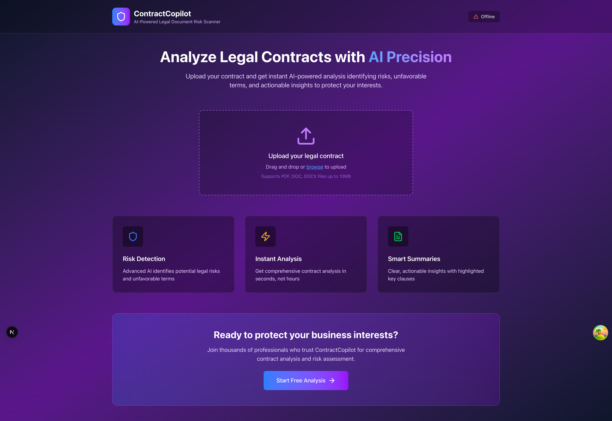

# ContractCopilot Frontend 🎨

A sleek, modern frontend for the AI-Powered Legal Document Risk Scanner built with Next.js 15, TypeScript, and TailwindCSS v4.



## ✨ Features

- **Modern UI/UX**: Beautiful gradient backgrounds with glass-morphism effects
- **Responsive Design**: Optimized for desktop, tablet, and mobile devices  
- **Real-time Health Monitoring**: Live backend status indicator
- **Drag & Drop Upload**: Intuitive contract file upload interface
- **TypeScript**: Full type safety throughout the application
- **Auto-generated API Client**: Seamless integration with backend APIs

## 🛠️ Tech Stack

- **Framework**: Next.js 15 (App Router)
- **Language**: TypeScript 5.6+
- **Styling**: TailwindCSS v4.1+
- **Data Fetching**: TanStack Query v5.90+
- **Icons**: Lucide React
- **API Client**: Auto-generated from OpenAPI spec
- **Screenshot**: Puppeteer for documentation

## 🚀 Getting Started

### Prerequisites

- Node.js 18+ (recommended: Node.js 20+)
- npm or yarn package manager
- Backend API running (see `/backend` directory)

### Installation

1. **Install dependencies**:
   ```bash
   npm install
   ```

2. **Start development server**:
   ```bash
   npm run dev
   ```

3. **Open your browser**:
   Navigate to [http://localhost:3000](http://localhost:3000)

## 📁 Project Structure

```
frontend/
├── app/                    # Next.js App Router
│   ├── globals.css        # Global styles & Tailwind imports
│   ├── layout.tsx         # Root layout component
│   └── page.tsx           # Home page
├── src/
│   ├── api/
│   │   └── generated/     # Auto-generated OpenAPI client
│   │       ├── api/       # API client classes
│   │       ├── models/    # TypeScript interfaces
│   │       └── docs/      # API documentation
│   ├── components/
│   │   └── HomePage.tsx   # Main landing page component
│   ├── config/
│   │   └── api.ts         # API configuration
│   └── hooks/
│       └── useApi.ts      # React Query hooks
├── docs/                  # Documentation & screenshots
├── scripts/               # Utility scripts
└── public/                # Static assets
```

## 🎨 Design System

### Color Palette
- **Primary**: Blue gradient (`from-slate-900 via-purple-900 to-slate-900`)
- **Accent**: Purple/Blue gradients
- **Glass Effects**: `bg-black/20 backdrop-blur-sm`
- **Interactive**: Hover animations with scale transforms

### Typography
- **Font**: Inter (Google Fonts)
- **Weights**: 300, 400, 500, 600, 700

### Components
- **Cards**: Glass-morphism with subtle borders
- **Buttons**: Gradient backgrounds with hover effects
- **Upload Zone**: Dashed border with drag-and-drop states
- **Health Indicator**: Real-time status with colored dots

## 🔗 API Integration

The frontend automatically generates TypeScript API clients from the backend's OpenAPI specification:

```bash
# Regenerate API client (requires Java 17+)
npm run generate-api
```

### Available Hooks
```typescript
import { useHealthCheck, useDetailedHealthCheck } from '@/hooks/useApi';

// Basic health check
const { data, isLoading } = useHealthCheck();

// Detailed health information  
const { data: details } = useDetailedHealthCheck();
```

## 📸 Screenshots

### Main Landing Page


The landing page features:
- ✅ Gradient background with animated effects
- ✅ Real-time backend health status indicator
- ✅ Drag-and-drop contract upload zone
- ✅ Feature showcase cards with icons
- ✅ Modern typography and spacing
- ✅ Responsive design for all devices

## 🧪 Development Scripts

```bash
# Development server
npm run dev

# Build for production
npm run build

# Start production server
npm start

# Generate API client from backend
npm run generate-api

# Take screenshot for documentation
node scripts/screenshot.js
```

## 🔧 Configuration

### TailwindCSS v4
The project uses the latest TailwindCSS v4 with PostCSS integration:

```javascript
// postcss.config.js
module.exports = {
  plugins: {
    '@tailwindcss/postcss': {},
    autoprefixer: {},
  },
}
```

### API Configuration
Backend API base URL is configured in `src/config/api.ts`:

```typescript
export const API_BASE_URL = 'http://localhost:8000';
```

## 🚀 Deployment

### Production Build
```bash
npm run build
npm start
```

### Docker (Coming Soon)
A Dockerfile will be added for containerized deployments.

## 🤝 Contributing

1. Follow the existing code style (TypeScript + ESLint)
2. Use semantic commit messages
3. Test your changes locally
4. Update documentation as needed

## 📄 License

This project is part of the ContractCopilot monorepo.

---

**Built with ❤️ using Next.js, TypeScript, and TailwindCSS**
